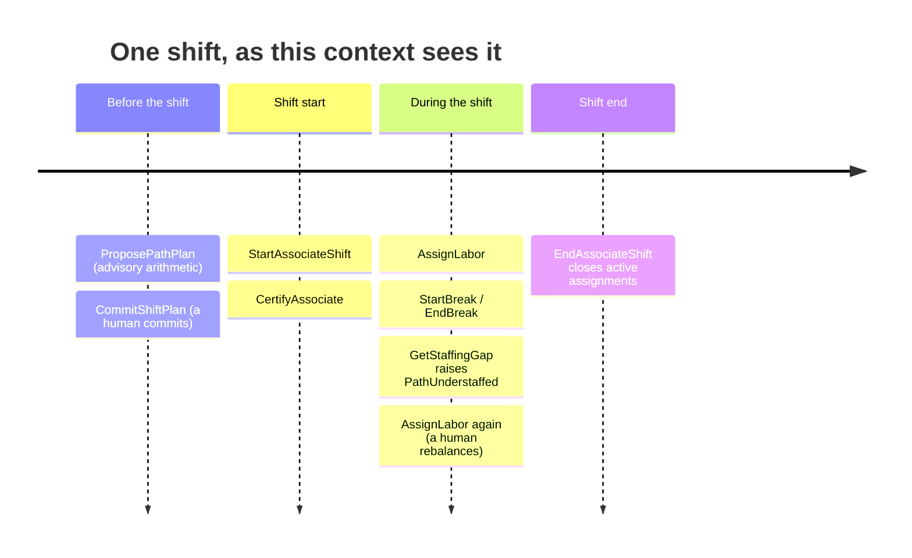

# Two planning horizons

This context spans two time horizons. They are different activities, but they
share a vocabulary and a consistency boundary, so they are one bounded context
rather than two.



## Horizon 1 — the shift-start planning horizon

Before the shift runs, someone has to answer: *given the charge due on each
path and the rate we expect to run it at, how many people do we need where?*

**The arithmetic is trivial and the software does it:**

```
heads = ceil(charge ÷ plannedRate)
```

`ProposePathPlan` returns that number for one path. It persists nothing. It has
no aggregate identity. Calling it twice with the same inputs is the same as
calling it once.

**The commitment is not trivial and a human makes it.** `CommitShiftPlan`
takes the full set of `PathPlan` lines for a building's shift and validates
them as one atomic decision:

- every line's `plannedHeads` must be at most the path's `installedStations`;
- every line's `plannedHours` must fit inside `plannedHeads × maxHoursPerShift`;
- at least one line must be present.

If any line fails, none of them commit. That is why `ShiftPlan` is an aggregate
rather than a bag of independent path rows: the plan is only meaningful as a
whole, because heads are a finite pool being divided.

`installedStations` arrives *in the request*, rather than being looked up from
another service. Work Planning owns installed-station counts, but this context
has no dependency on Work Planning and does not want one — so the caller
carries the numbers it needs to be validated against. See
[Design decisions](#design-decisions-that-fall-out-of-this) below.

## Horizon 2 — intra-shift assignment tracking

Once the shift is running, the plan starts drifting. Somebody calls in sick, a
tote jam empties a pick aisle, the pack line starts falling behind CPT. People
get moved.

Each move is recorded with `AssignLabor`, which:

1. checks the associate holds the path's required certification;
2. checks they are not currently on a logged break and their shift has not
   ended;
3. closes any assignment that was already active (logging its hours);
4. opens a new interval and raises `LaborAssigned` — or `LaborReassigned` when
   step 3 actually closed something.

Note step 3: a second assignment does not fail, it *supersedes*. That matches
the floor, where a supervisor moves someone without first "unassigning" them.
The one-active-assignment invariant still holds absolutely — it is structural,
because the aggregate holds a single optional active interval and physically
cannot hold two. See
[ADR 0003](../adr/0003-certification-gated-single-active-assignment.md).

## Where the two horizons meet

`GetStaffingGap` is the join, and the only place both horizons appear at once:

```
plannedHeads(path)   ← horizon 1, the committed ShiftPlan
activeHeads(path)    ← horizon 2, the live LaborAssignments
understaffed         ← activeHeads < plannedHeads
```

It is a **projection**, not stored state. No aggregate carries a "current
headcount" field that could drift out of sync with the assignments it is
supposed to summarise. This is the standard rule across the platform: read
models are derived, never redundantly persisted on the write model.

## Design decisions that fall out of this

- **`GetStaffingGap` takes `buildingId` and `shiftId` as query parameters**
  (`GET /paths/{pathId}/staffing-gap?buildingId=&shiftId=`) because `ShiftPlan`
  is keyed by building plus shift. A path's planned heads are meaningless
  outside a specific committed plan.
- **A path's required certification is the certification with the same name.**
  Path `pack` requires certification `pack`. This is a naming convention, not a
  lookup: introducing a "path requirements" port would add a whole
  cross-aggregate concept for a single string comparison. The convention is
  documented rather than modelled.
- **`plannedHours ≤ plannedHeads × maxHoursPerShift`** is how "the sum of
  planned hours must be valid" is enforced. A path line cannot commit more
  total hours than its planned heads could physically work within one shift's
  cap.
