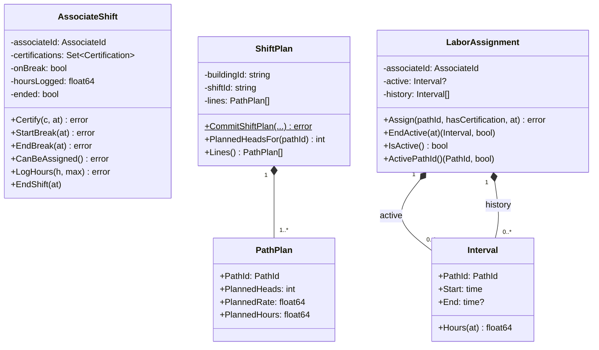

# Aggregates

Three aggregate roots, each in its own package under `internal/domain/`, each
depending on nothing but `internal/domain/shared`.

## AssociateShift

**Package:** `internal/domain/associate` · **Identity:** `AssociateId`

The roster entry: who is on this shift, what they are qualified for, whether
they are on a logged break, and how many hours they have accumulated.

**Consistency boundary.** One associate, one shift. Every rule about a single
person's availability — break state, shift-ended state, the hours cap — is
enforced here in one transaction, because they are all facts about the same
person at the same moment.

**Why it is a root rather than an entity inside `LaborAssignment`.** Because it
outlives any single assignment and is read by contexts that have no interest in
assignments at all. `fulfillment-execution` reads certifications to gate a
station claim; it does not care which path the associate is on. Nesting the
roster inside the assignment record would force every certification reader
through an assignment-shaped door.

**Raises:** `AssociateShiftStarted`, `AssociateCertified`,
`AssociateBreakStarted`, `AssociateBreakEnded`, `AssociateShiftEnded`.

## ShiftPlan

**Package:** `internal/domain/shiftplan` · **Identity:** `(buildingId, shiftId)`

The committed split of headcount across paths for one building's shift, made of
`PathPlan` lines. Exactly one per building per shift.

**Consistency boundary.** The whole plan. `CommitShiftPlan` validates every line
before constructing anything, and returns an error rather than a partially
committed plan if any line fails. Heads are a finite pool being divided, so a
plan is only meaningful in one piece.

**`PathPlan` is a value object, not an entity.** It has no identity of its own
and no lifecycle — you do not "update a path plan," you commit a new plan.
`ShiftPlan.Lines()` returns a defensive copy for exactly this reason.

**`ProposedHeads` is a free function, not a method.** `ProposedHeads(charge,
plannedRate) = ceil(charge ÷ plannedRate)` has no aggregate identity because a
proposal is not a commitment. It sits in the `shiftplan` package as pure
arithmetic and touches nothing.

**Raises:** `ShiftPlanProposed`, `ShiftPlanCommitted`, and the derived
`PathUnderstaffed` flag.

## LaborAssignment

**Package:** `internal/domain/assignment` · **Identity:** `AssociateId`

One associate's current path assignment plus their assignment history for the
shift.

**The identity choice is the invariant.** From the package doc comment:

> The aggregate root is keyed by associate so that "exactly one ACTIVE
> assignment per associate" is a structural invariant — there is only ever one
> active-interval field to hold it in.

This is worth dwelling on. The obvious modelling — one aggregate *per
assignment*, keyed by an `AssignmentId` — would make "exactly one active per
associate" a **cross-aggregate** rule, enforceable only by querying for other
active assignments and hoping nothing races you. Keying the root by
`AssociateId` and holding a single `active *Interval` field makes the rule
unrepresentable-if-violated: there is no second field to put a second active
assignment in.

**Assignment supersedes rather than rejects.** Calling `Assign` while an
interval is active closes the old one (logging its hours against the
`AssociateShift`) and opens a new one, raising `LaborReassigned` instead of
`LaborAssigned`. That is the floor's actual behaviour — a supervisor moves
someone, they do not first "unassign" them. Either behaviour would satisfy the
invariant; this one was chosen and is documented in
[ADR 0003](../adr/0003-certification-gated-single-active-assignment.md).

**Raises:** `LaborAssigned`, `LaborReassigned`.

## Shared value objects

**Package:** `internal/domain/shared`

| Type | Rule |
| --- | --- |
| `AssociateId` | non-empty; `ErrEmptyAssociateId` otherwise |
| `PathId` | non-empty; `ErrEmptyPathId` otherwise |
| `Certification` | non-empty; `ErrEmptyCertification` otherwise |
| `DomainEvent` | interface: `EventName() string`, `OccurredAt() time.Time` |

Constructors validate, so an invalid identifier cannot exist as a value. The
HTTP adapter maps each construction error onto a `400` with its own RFC 7807
type.

## Read models are projections, never state

There is no `activeHeads` field on `ShiftPlan`, and no `utilization` field on
`AssociateShift`. Both read models —

- heads-planned-versus-active per path (`GetStaffingGap`),
- per-associate utilization,

— are computed from the aggregates and events at read time. Storing them on the
write model would create a second source of truth that can silently drift from
the assignments it claims to summarise.
