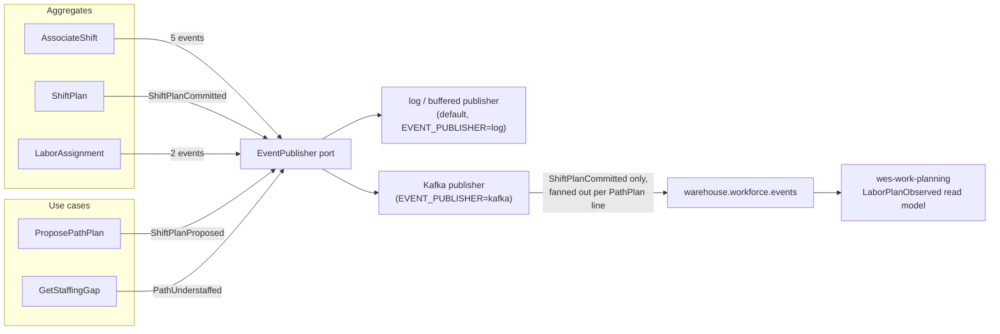

# Domain events

Ten events, all past tense, all implementing
`shared.DomainEvent` (`EventName() string`, `OccurredAt() time.Time`). Their
names are fixed vocabulary — they appear verbatim in the Go code, in
`apis/asyncapi.yaml`, and in this documentation.

## The catalog

| Event | Raised by | When | Payload |
| --- | --- | --- | --- |
| `ShiftPlanProposed` | `ProposePathPlan` use case | Heads were computed for a path, ahead of any commit | `buildingId`, `pathId`, `plannedHeads`, `plannedRate` |
| `ShiftPlanCommitted` | `ShiftPlan` | A human committed the headcount split | `buildingId`, `shiftId` |
| `AssociateShiftStarted` | `AssociateShift` | A roster entry opened | `associateId`, `certifications` |
| `AssociateCertified` | `AssociateShift` | A certification was added | `associateId`, `certification` |
| `AssociateBreakStarted` | `AssociateShift` | A logged break began | `associateId` |
| `AssociateBreakEnded` | `AssociateShift` | A logged break ended | `associateId` |
| `LaborAssigned` | `LaborAssignment` | An associate was placed on a path (first assignment) | `associateId`, `pathId` |
| `LaborReassigned` | `LaborAssignment` | An active assignment was closed in favour of another path | `associateId`, `fromPathId`, `toPathId` |
| `PathUnderstaffed` | `GetStaffingGap` use case | Active assignments fell short of committed heads | `pathId`, `plannedHeads`, `activeHeads` |
| `AssociateShiftEnded` | `AssociateShift` | A shift closed, ending all active assignments | `associateId` |

## Which ones leave the process

**One.** As of this version the outbound Kafka adapter
(`internal/adapters/outbound/kafka/publisher.go`) forwards **only**
`ShiftPlanCommitted`. Every other event is raised, published through the
`EventPublisher` port, and consumed in-process by the log/buffered publisher.

`apis/asyncapi.yaml` documents all ten as the complete **reference catalog** of
this context's domain events, which is deliberately broader than what leaves
the process today. Each message in that spec states its publication status
explicitly. See the [Events page](../api-reference/events.md) for the
CloudEvents envelope, the `type` naming convention, and every payload shape.

## The fan-out that catches people out

A `ShiftPlan` has multiple `PathPlan` lines, and the Kafka adapter publishes
**one message per line**, not one per commit. A plan committed with three path
lines produces **three** messages on `warehouse.workforce.events`, each
carrying that single line's `path_id`, `planned_heads`, `planned_rate` and
`planned_hours` alongside the plan's `building_id` and `shift_id`.

This matches how the downstream consumer keys its read model —
`wes-work-planning`'s `LaborPlanObserved` is keyed by `path_id`, one row per
path. Consumers must expect N messages per commit and must not assume a message
carries the whole plan.

The domain event itself carries only `buildingId` and `shiftId` (the
`ShiftPlan`'s identity). The adapter loads the committed plan through the
`ShiftPlanRepo` to do the fan-out, which keeps the fan-out an integration
concern rather than a domain one.

## Events raised but not consumed downstream — deliberately

`LaborAssigned` and `LaborReassigned` are individually meaningful on the floor
but are **not** published cross-service, and that is not an oversight. Anything
downstream that consumed them would be reconstructing a per-associate location
picture — which is precisely the picture this context refuses to expose past
the path boundary. If a real downstream need appears, the right shape is a
read-model endpoint, not an event stream of individual moves.

`PathUnderstaffed` is likewise in-process today. It is a **flag, not a
decision**, and the platform's rebalancing authority is human, so it currently
surfaces through `GetStaffingGap`'s response rather than a topic.

## Where each event is constructed

Eight of the ten are recorded **inside an aggregate** and pulled out by the
application layer via `PullEvents()`. Two are constructed in the application
layer instead, and for the same reason in both cases — neither corresponds to a
state change on an aggregate:

- `ShiftPlanProposed` is raised by the `ProposePathPlan` use case, which
  computes `ceil(charge ÷ plannedRate)` and persists nothing. There is no
  aggregate instance to record it on, because a proposal has no identity.
- `PathUnderstaffed` is raised by the `GetStaffingGap` use case, which compares
  a committed plan against a live count. It is derived from a read model, and
  read models are projections — recording it on `ShiftPlan` would put derived
  state on the write model.

`apis/asyncapi.yaml` attributes both to the `ShiftPlan` aggregate for catalog
purposes, since that is the aggregate whose committed plan they are measured
against. The construction site in code is the use case.

## Event sourcing? No.

Aggregates record events and hand them to the application layer via
`PullEvents()`, which publishes them through the `EventPublisher` port. State is
persisted as state (`Rehydrate` reconstructs from rows without raising events),
not replayed from a log. Events are the **integration and notification**
mechanism, not the storage mechanism.
