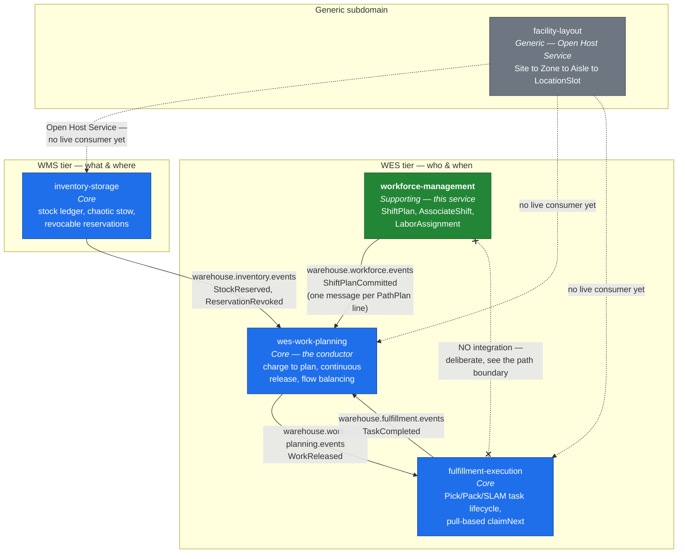
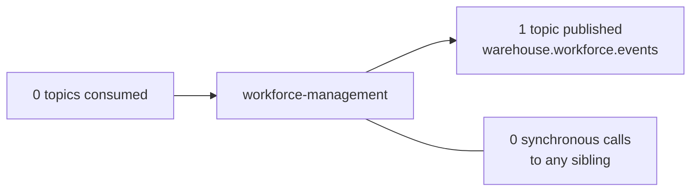

# Context map

## What is actually wired today

Solid arrows are live Kafka topics with a real producer and a real consumer in
the code as it stands. Dashed arrows are strategic relationships with **no**
implementation.

## Reading the diagram

**One outbound edge, zero inbound edges.** This service publishes
`ShiftPlanCommitted` and consumes nothing. It has no Kafka consumer, no HTTP
client for any sibling, and no shared database. A Supporting context that
sits in nobody's critical path is a Supporting context that can be deployed,
restarted or rolled back without a change-control conversation.

**The `wes-work-planning` edge is the supply side of planning.** Work Planning
is the conductor — it decides what work to release and when, and it
flow-balances against live buffer telemetry. Committed headcount per path is
one of its inputs, and this service is the authoritative source of it. The edge
carries the *plan*, never the roster: no associate identity, no break state, no
individual assignment ever crosses it.

**The crossed edge to `fulfillment-execution` is the important one.** Two
services that both deal in people doing work, with no contract between them.
That is the [path boundary](../business-context/path-boundary.md): this context
stops at "which path is this associate on," and task dispatch is a
seconds-cadence problem that gets to evolve entirely independently. Drawing it
as an explicit non-edge is more honest than leaving it off the diagram, because
its absence is a decision, not an omission.

**`facility-layout`'s edges are all dashed.** It is the newest service and an
Open Host Service by design — its own `CLAUDE.md` names the other four as
downstream Conformists — but nothing consumes it yet, in any repo. Shown as
strategic-only.

## Strategic relationships

The technical wiring above is narrower than the strategic picture. In
context-mapping vocabulary:

### workforce-management → wes-work-planning: **Customer/Supplier**

This context is the upstream **supplier** of committed labor; Work Planning is
the downstream **customer**. The supplier publishes a narrow, stable **Published
Language** — one event type, six scalar fields — and the customer *translates*
rather than conforms: `ShiftPlanCommitted` becomes `LaborPlanObserved`, a read
model in Work Planning's own vocabulary, never its `ShiftPlan` aggregate.

That translation matters. `ShiftPlan` exists in both services and means
different things: here it is the labor commitment a human made; there it is
Work Planning's own planning artefact derived from charge and CPT. The platform
DDD reference names this trap explicitly —

> Same English word, two different models. Do not share the class across
> contexts.

— and Work Planning's own `CLAUDE.md` instructs its implementers, in capitals,
not to feed the consumed event into its own aggregate. The anti-corruption step
lives on the consumer side, which is where it belongs.

### workforce-management ↔ fulfillment-execution: **deliberate separation**

Not "not yet integrated" — *separated*, with a reason. The two contexts change
at cadences three orders of magnitude apart (shift-length intervals versus
per-task claims), so fusing them would make every dispatch-policy change a
workforce-planning change.

If a certification gate on station claims is ever wired to real data, the shape
is `fulfillment-execution` as a downstream **Conformist** to this context's
published read surface — read-only, one-way, no write access to
`AssociateShift`. The reverse — this context learning what task anyone is
performing — is the thing the boundary exists to prevent.

### facility-layout → workforce-management: **Conformist, unexercised**

`facility-layout` is an **Open Host Service** with a **Published Language** and
declares all four siblings, including this one, as downstream Conformists.

For this context that conformance is likely to stay theoretical. A `PathId`
here is `pack` or `pick` — a queue with a service rate, not a place. Labor
planning needs no aisle geometry. If travel-time-aware planning were ever
built, that is when this edge would become real.

### The WMS tier: **no relationship, correctly**

`inventory-storage` owns stock truth. The platform DDD reference is emphatic
that worker identity must stay *out* of the WMS tier:

> WMS "has **zero** knowledge of individual workers, shifts, real-time
> location, or travel distance. If it acquires that knowledge, a
> supporting/generic concern (labor orchestration) has leaked into the core
> domain (order fulfillment truth), and every labor policy change now forces a
> WMS regression."

The absence of an edge between this service and `inventory-storage` is that
rule holding.

## Direction of dependency, summarised

The one place this shape shows up in the API is `CommitShiftPlan`, which takes
`installedStations` **in the request body** instead of looking it up from
`wes-work-planning`. That service owns installed-station counts, but taking a
runtime dependency on a Core context in order to validate a Supporting
context's own invariant would invert the risk. So the caller carries the
numbers, and this context validates against them independently.
