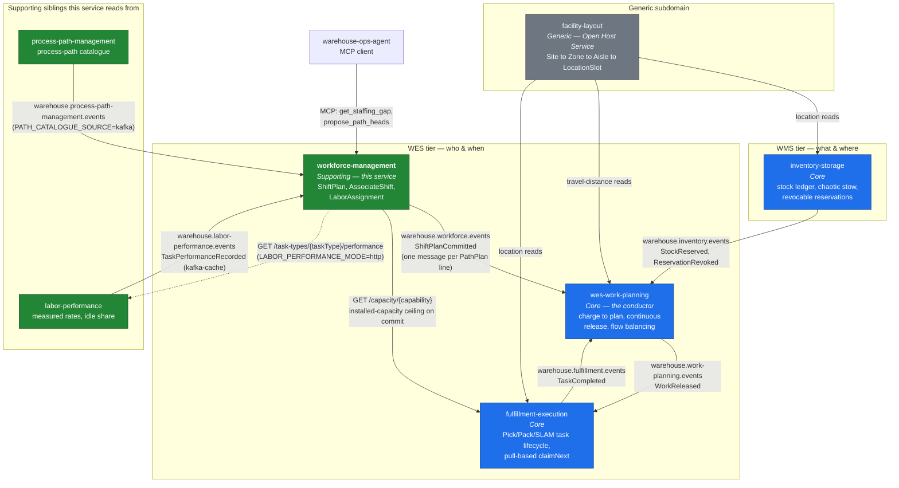
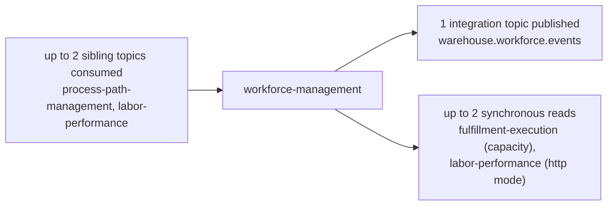

# Context map

## What is actually wired today

Solid arrows are live edges with real code on both ends: Kafka topics with a
real producer and consumer, and synchronous HTTP reads (labelled `GET`).
Dashed arrows are strategic relationships with **no** implementation. The
diagram shows this service's own edges plus the sibling edges that give it
context. It is not the full fleet map.

## Reading the diagram

**One topic published, reads from three siblings, no shared database.** This
service publishes `ShiftPlanCommitted`. It *reads from* siblings in three
ways, each selected by an env var (see [Integration](./integration.md)):

- the live installed capacity from `fulfillment-execution` on every
  `CommitShiftPlan` ([ADR 0014](../adr/0014-installed-capacity-ceiling.md));
- measured rates and idle share from `labor-performance`, either from its
  topic (`kafka-cache`, as in the kind cluster) or over HTTP
  ([ADR 0012](../adr/0012-measured-rate-feed-for-propose-path-plan.md),
  [0019](../adr/0019-labor-performance-cache-consumer.md),
  [0020](../adr/0020-idle-share-staffing-signal.md));
- the process-path catalogue from `process-path-management`'s topic, when
  `PATH_CATALOGUE_SOURCE=kafka`. Otherwise it comes from a file.

In every one of these edges, data flows *into* this service. The only
callers of this service are read-only: `wes-work-planning` consumes the topic,
and `warehouse-ops-agent` calls two MCP tools (`get_staffing_gap`,
`propose_path_heads`) and reads the labor report (`GET /reports/labor`). No
sibling invokes one of this service's commands, so it is still in no Core
context's write path. The reverse no longer holds, though: `CommitShiftPlan`
now depends on `fulfillment-execution` being reachable, and fails loud (503)
when it is not.

**The `wes-work-planning` edge is the supply side of planning.** Work Planning
is the conductor — it decides what work to release and when, and it
flow-balances against live buffer telemetry. Committed headcount per path is
one of its inputs, and this service is the authoritative source of it. The edge
carries the *plan*, never the roster: no associate identity, no break state, no
individual assignment ever crosses it.

**The edge to `fulfillment-execution` is capacity, not tasks.** The two
services both deal in people doing work. The one contract between them is a
read of *installed station capacity per capability*
(`GET /capacity/{capability}`), which acts as a physical ceiling on committed
heads. No task, claim, or associate identity crosses it in either direction.
The [path boundary](../business-context/path-boundary.md) still holds: this
context stops at "which path is this associate on," and task dispatch is a
seconds-cadence problem that evolves independently.

**`facility-layout` is now consumed by the WMS/WES services, not by this one.**
It is an Open Host Service by design. `inventory-storage`, `wes-work-planning`
and `fulfillment-execution` read locations or travel distances from it. This
service has no edge to it, for the reason given below.

## Strategic relationships

The technical wiring above is narrower than the strategic picture. In
context-mapping vocabulary:

### workforce-management → wes-work-planning: **Customer/Supplier**

This context is the upstream **supplier** of committed labor; Work Planning is
the downstream **customer**. The supplier publishes a narrow, stable **Published
Language** — one event type, six scalar fields — and the customer *translates*
rather than conforms: `ShiftPlanCommitted` becomes `LaborPlanObserved`, a read
model in Work Planning's own vocabulary, never its `ShiftPlan` aggregate.

That translation matters. `ShiftPlan` exists in both services and means
different things: here it is the labor commitment a human made; there it is
Work Planning's own planning artefact derived from charge and CPT. The platform
DDD reference names this trap explicitly —

> Same English word, two different models. Do not share the class across
> contexts.

— and Work Planning's own `CLAUDE.md` instructs its implementers, in capitals,
not to feed the consumed event into its own aggregate. The anti-corruption step
lives on the consumer side, which is where it belongs.

### workforce-management ↔ fulfillment-execution: **separated at the task level, Conformist on capacity**

At the task level, not "not yet integrated" — *separated*, with a reason. The
two contexts change at cadences three orders of magnitude apart
(shift-length intervals versus per-task claims), so fusing them would make
every dispatch-policy change a workforce-planning change.

The one live edge is narrower than that. This context is a downstream
**Conformist** on `fulfillment-execution`'s installed-capacity read
(`GET /capacity/{capability}`, [ADR 0014](../adr/0014-installed-capacity-ceiling.md)).
It uses the count as a ceiling on committed heads and learns nothing about
tasks or claims.

If a certification gate on station claims is ever wired to real data, the shape
is `fulfillment-execution` as a downstream **Conformist** to this context's
published read surface — read-only, one-way, no write access to
`AssociateShift`. The reverse — this context learning what task anyone is
performing — is the thing the boundary exists to prevent.

### facility-layout → workforce-management: **Conformist, unexercised**

`facility-layout` is an **Open Host Service** with a **Published Language** and
declares all four siblings, including this one, as downstream Conformists.

For this context that conformance is likely to stay theoretical. A `PathId`
here is `pack` or `pick` — a queue with a service rate, not a place. Labor
planning needs no aisle geometry. If travel-time-aware planning were ever
built, that is when this edge would become real.

### The WMS tier: **no relationship, correctly**

`inventory-storage` owns stock truth. The platform DDD reference is emphatic
that worker identity must stay *out* of the WMS tier:

> WMS "has **zero** knowledge of individual workers, shifts, real-time
> location, or travel distance. If it acquires that knowledge, a
> supporting/generic concern (labor orchestration) has leaked into the core
> domain (order fulfillment truth), and every labor policy change now forces a
> WMS regression."

The absence of an edge between this service and `inventory-storage` is that
rule holding.

## Direction of dependency, summarised

`CommitShiftPlan` still takes `installedStations` **in the request body**
instead of looking it up from `wes-work-planning`, and validates it
independently. Since [ADR 0014](../adr/0014-installed-capacity-ceiling.md) it
*also* checks each line against `fulfillment-execution`'s live installed
capacity. That call is fail-loud: when capacity cannot be verified, the commit
is rejected with 503 rather than silently allowed.

## Presentation-layer composition (not a domain-coupling edge)

`warehouse-ops-agent`'s fleet-wide ADR-0002 adds a seventh axis to this map
that is deliberately absent from the diagrams above: `warehouse-console`, a
Module Federation shell, composes one remote per bounded context at the UI
layer, including `workforce-mfe` (this context's own `web/`). This context's
adoption of that decision is recorded in
[ADR-0011](../adr/0011-adopt-fleet-mfe-console-architecture.md).

This is **not** a new domain relationship and is not drawn as an edge above:
`workforce-mfe` talks only to this service's own REST API
(`WORKFORCE_API_BASE`), never to a sibling's API or database, and the shell
contains none of this context's business logic. It does not change this
context's integration edges (listed in [Integration](./integration.md)) — it
is a browser composing
independently-owned screens, not a new integration contract between bounded
contexts. The one cross-cutting exception in the fleet (the Order Lifecycle
view, backed by a BFF in `warehouse-ops-agent`) does not read this context's
data at all today. `warehouse-ops-agent`'s console reports read this
context's labor report (`GET /reports/labor` on `cmd/workforce-reports`), and
its agent calls this context's MCP tools. Both are reads of this context's
published surfaces.
