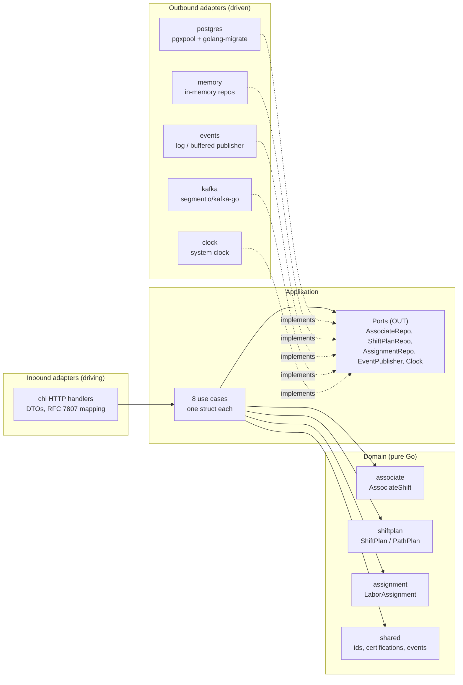

# Architecture

The service is **hexagonal / ports-and-adapters**, with one non-negotiable
dependency rule:

> **domain depends on nothing; application depends on domain; adapters depend
> on application and domain.**

No framework type and no SQL type appears anywhere in `internal/domain`.



## Package map

```
cmd/workforce/                composition root — env config, wiring, main()
internal/
  domain/
    associate/                 AssociateShift aggregate (roster, certifications, breaks)
    shiftplan/                 ShiftPlan aggregate (committed headcount split across paths)
    assignment/                LaborAssignment aggregate (one associate, one path, an interval)
    shared/                    value objects: AssociateId, PathId, Certification, domain events
  application/
    ports/                     OUT: AssociateRepo, ShiftPlanRepo, AssignmentRepo, EventPublisher, Clock
    usecases/                  one struct per use case
  adapters/
    inbound/http/              chi handlers, DTOs, error mapping
    outbound/postgres/         pgxpool repos
    outbound/memory/           in-memory repos for tests and local runs
    outbound/events/           log/buffered publisher
    outbound/kafka/            Kafka publisher (segmentio/kafka-go)
    outbound/clock/            system clock
  architecture/                arch-go fitness tests for the rules above
migrations/                    golang-migrate SQL files
features/                      Gherkin acceptance specs (godog)
apis/                          openapi.yaml + asyncapi.yaml
charts/                        Helm chart
```

## The rule is executable, not aspirational

`internal/architecture/architecture_test.go` encodes the dependency rule as
real Go tests using [arch-go](https://github.com/arch-go/arch-go), and CI runs
them as a blocking `arch-test` job. The tests assert that:

- `internal/domain/...` imports nothing else from this module;
- `internal/application/...` imports only `internal/domain/...`;
- inbound and outbound adapters never import each other;
- only `cmd/` is allowed to wire everything together.

A layering violation therefore fails the build rather than surviving as a code
review comment. See [ADR 0007](../adr/0007-arch-go-architecture-fitness-tests.md).

## The eight use cases

| Use case | What it does |
| --- | --- |
| `StartAssociateShift` | Opens a roster entry with initial certifications |
| `CertifyAssociate` | Adds one certification to an existing roster entry |
| `ProposePathPlan` | Pure computation: `heads = ceil(charge ÷ plannedRate)`. Persists nothing |
| `CommitShiftPlan` | Validates and commits the headcount split; publishes `ShiftPlanCommitted` |
| `AssignLabor` | Puts an associate on a path, closing any prior active assignment |
| `StartBreak` / `EndBreak` | Opens and closes a logged break |
| `GetStaffingGap` | Read model: planned heads versus active assignments for a path |
| `EndAssociateShift` | Closes active assignments, then the shift |

`ProposePathPlan` is deliberately the odd one out: it touches no repository at
all, because a proposal is advisory. The software proposes; a human commits.

## Quality gates

Every one of these runs in CI on every push and pull request:

| Gate | Tool |
| --- | --- |
| Lint | `golangci-lint` (errcheck, govet, staticcheck, unused, ineffassign, bodyclose, misspell, unconvert, gocritic) |
| Unit tests + race | `go test ./... -race`, coverage ≥ 90% on domain + application |
| Postgres integration | build-tagged tests against a live Postgres 16 service container |
| Architecture fitness | `arch-go` via `internal/architecture` |
| BDD acceptance | `godog` over the real chi router |
| OpenAPI + AsyncAPI lint | Spectral, against `apis/*.yaml` |
| Helm chart lint | `ct lint` |
| Mutation testing | `gremlins` — weekly and on manual dispatch, never blocking PRs |
