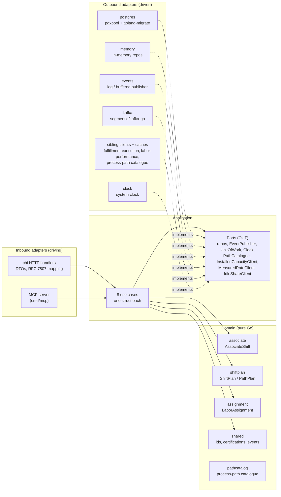

# Architecture

The service is **hexagonal / ports-and-adapters**, with one non-negotiable
dependency rule:

> **domain depends on nothing; application depends on domain; adapters depend
> on application and domain.**

No framework type and no SQL type appears anywhere in `internal/domain`.



## Package map

```
cmd/workforce/                OLTP service — env config, wiring, outbox relay, main()
cmd/workforce-reports/        analytical data product read API (GET /reports/labor)
cmd/workforce-projector/      consumes warehouse.workforce.analytics into the report projection
cmd/mcp/                      MCP server (Streamable HTTP) over the same use cases
internal/
  domain/
    associate/                 AssociateShift aggregate (roster, certifications, breaks)
    shiftplan/                 ShiftPlan aggregate (committed headcount split across paths)
    assignment/                LaborAssignment aggregate (one associate, one path, an interval)
    pathcatalog/               process-path catalogue model (ADR 0013)
    shared/                    value objects: AssociateId, PathId, Certification, domain events
  application/
    ports/                     OUT: repos, EventPublisher, UnitOfWork, ProcessedEvents, Clock,
                               PathCatalogue, InstalledCapacityClient, MeasuredRateClient, IdleShareClient
    usecases/                  one struct per use case
  analytics/report/            labor report read model + ports (ADR 0010)
  adapters/
    inbound/http/              chi handlers, DTOs, error mapping
    inbound/mcp/               MCP tools, resources, prompts
    inbound/kafka/             analytics-topic consumer for the projector
    outbound/postgres/         pgxpool repos, unit of work, transactional outbox + relay
    outbound/memory/           in-memory repos for tests and local runs
    outbound/events/           log/buffered publisher
    outbound/kafka/            Kafka publishers (segmentio/kafka-go)
    outbound/analyticsstore/   analytical projection + report store
    outbound/fulfillmentexecution/  installed-capacity client (ADR 0014)
    outbound/laborperformance/      measured-rate HTTP client (ADR 0012)
    outbound/laborperformancecache/ event-fed measured-rate + idle-share cache (ADR 0019, 0020)
    outbound/filecatalog/      process-path catalogue from a YAML file
    outbound/kafkacatalog/     process-path catalogue from process-path-management's topic
    outbound/telemetry/        OpenTelemetry setup
    outbound/clock/            system clock
  architecture/                arch-go fitness tests for the rules above
migrations/                    golang-migrate SQL files
features/                      Gherkin acceptance specs (godog)
apis/                          openapi.yaml + asyncapi.yaml
charts/                        Helm chart
```

## The rule is executable, not aspirational

`internal/architecture/architecture_test.go` encodes the dependency rule as
real Go tests using [arch-go](https://github.com/arch-go/arch-go), and CI runs
them as a blocking `arch-test` job. The tests assert that:

- `internal/domain/...` imports nothing else from this module;
- `internal/application/...` imports only `internal/domain/...`;
- inbound and outbound adapters never import each other;
- only `cmd/` is allowed to wire everything together.

A layering violation therefore fails the build rather than surviving as a code
review comment. See [ADR 0007](../adr/0007-arch-go-architecture-fitness-tests.md).

## The eight use cases

| Use case | What it does |
| --- | --- |
| `StartAssociateShift` | Opens a roster entry with initial certifications |
| `CertifyAssociate` | Adds one certification to an existing roster entry |
| `ProposePathPlan` | Advisory computation: `heads = ceil(charge ÷ rate)`, using the caller's rate or a measured one from `labor-performance`, optionally trimmed by observed idle share. Persists nothing |
| `CommitShiftPlan` | Validates the headcount split (including the live installed-capacity ceiling from `fulfillment-execution`) and commits it; publishes `ShiftPlanCommitted` |
| `AssignLabor` | Puts an associate on a path, closing any prior active assignment |
| `StartBreak` / `EndBreak` | Opens and closes a logged break |
| `GetStaffingGap` | Read model: planned heads versus active assignments for a path, plus observed idle share when available |
| `EndAssociateShift` | Closes active assignments, then the shift |

`ProposePathPlan` is deliberately the odd one out: it touches no repository at
all, because a proposal is advisory. The software proposes; a human commits.
(It may read measured rates and idle share from `labor-performance`, but it
writes nothing.)

## Quality gates

These run in `.github/workflows/ci.yml`; unless noted, on every push and pull request:

| Gate | Tool |
| --- | --- |
| Lint | `golangci-lint` (errcheck, govet, staticcheck, unused, ineffassign, bodyclose, misspell, unconvert, gocritic) |
| Unit tests + race | `go test ./... -race`, coverage ≥ 90% on domain + application |
| Integration | build-tagged tests against a live Postgres 16 service container, plus testcontainers-backed outbox and Kafka-consumer tests |
| Architecture fitness | `arch-go` via `internal/architecture` |
| BDD acceptance | `godog` over the real chi router |
| OpenAPI + AsyncAPI lint | Spectral, against `apis/*.yaml` |
| Helm chart lint | `ct lint` — pull requests into `main` only |
| Mutation testing | `gremlins` — weekly and on manual dispatch, never blocking PRs |
| Drift | `deadcode`, `go mod tidy -diff`, `knip` on `web/` — weekly and on manual dispatch |
| Generated API docs | `docs-api-drift` regenerates `docs/docs/api-reference/rest` and fails on a diff |
| Vulnerabilities / image | `govulncheck`; Trivy image scan (pull requests into `main` only) |
